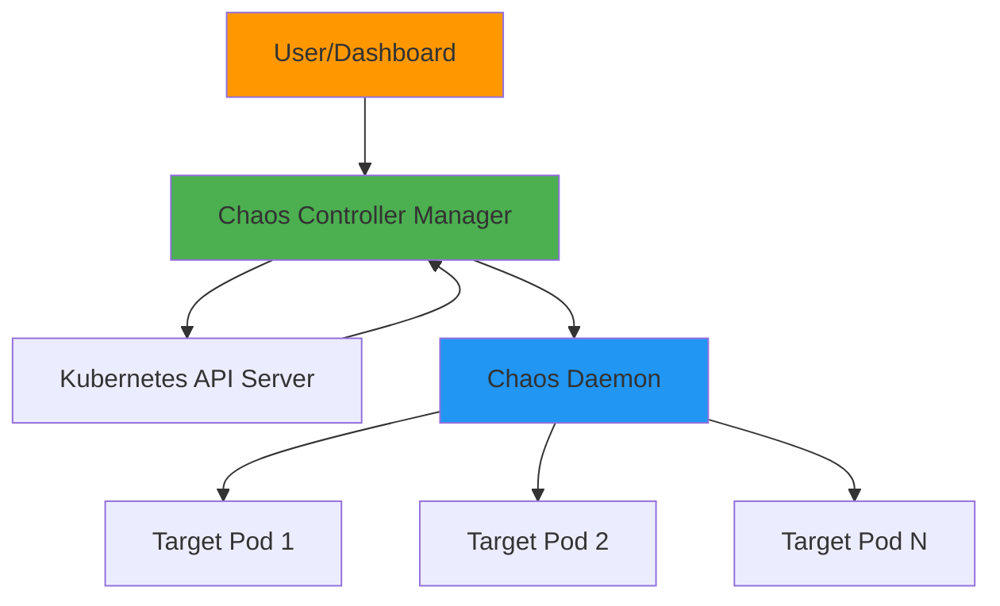
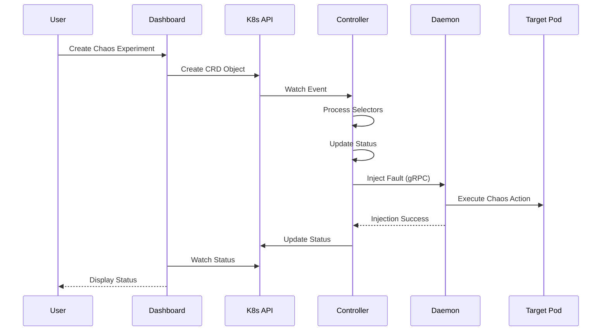

Chaos Mesh is a cloud-native Chaos Engineering platform built on Kubernetes. It provides a comprehensive solution for injecting various types of faults into your Kubernetes infrastructure and applications.

## High-Level Architecture

Chaos Mesh consists of three main components that work together to orchestrate chaos experiments:

## Core Components

<CardGroup cols={3}>
  <Card title="Controller Manager" icon="gear">
    The brain of Chaos Mesh, responsible for scheduling and managing chaos experiments
  </Card>
  
  <Card title="Chaos Daemon" icon="server">
    The executor that performs actual fault injection on target pods
  </Card>
  
  <Card title="Dashboard" icon="chart-line">
    Web UI for designing, managing, and monitoring chaos experiments
  </Card>
</CardGroup>

### 1. Chaos Controller Manager

The Chaos Controller Manager is the core orchestration component that runs as a Kubernetes deployment. It is primarily responsible for:

- **Experiment Scheduling**: Managing the lifecycle of chaos experiments defined as Custom Resource Definitions (CRDs)
- **CRD Controllers**: Running multiple controllers for different chaos types (PodChaos, NetworkChaos, IOChaos, etc.)
- **Workflow Management**: Coordinating complex chaos scenarios through the Workflow Controller
- **Selector Processing**: Determining which pods should be targeted based on selectors
- **Status Tracking**: Maintaining the state of experiments and updating status conditions

**Location**: `cmd/controller-manager/` and `controllers/`

<Info>
The controller manager follows strict design principles:
- **One Controller Per Field**: Each field is controlled by at most one controller to avoid conflicts
- **Standalone Operation**: Controllers work independently without depending on other controllers
- **Simple Behavior**: Controller logic is designed to be simple and describable in ~100 words
</Info>

**Key Controllers**:
- Workflow Controller: Manages workflow experiments (`controllers/`)
- Scheduler Controller: Handles scheduled experiments (`controllers/`)
- Chaos Type Controllers: One for each chaos type (14 types total)
  - Located in `controllers/chaosimpl/` (awschaos, azurechaos, blockchaos, dnschaos, gcpchaos, httpchaos, iochaos, jvmchaos, kernelchaos, networkchaos, physicalmachinechaos, podchaos, stresschaos, timechaos)

### 2. Chaos Daemon

The Chaos Daemon runs as a DaemonSet on each Kubernetes node with privileged permissions. It serves as the execution engine for fault injection:

- **Namespace Access**: Hacks into target Pod namespaces to perform low-level operations
- **Network Manipulation**: Uses traffic control (tc), iptables, and ipset for network chaos
- **File System Interference**: Injects I/O faults using FUSE-based mechanisms
- **Kernel-Level Injection**: Performs kernel fault injection using BPF
- **Container Runtime Integration**: Interacts with Docker, containerd, and CRI-O

**Location**: `cmd/chaos-daemon/` and `pkg/chaosdaemon/`

**Key Capabilities**:
- gRPC server exposing fault injection APIs (`pkg/chaosdaemon/pb/chaosdaemon.proto`)
- Network chaos via tc/netem (`pkg/chaosdaemon/tc_server.go`, `pkg/chaosdaemon/netem/`)
- I/O chaos via FUSE (`pkg/chaosdaemon/iochaos_server.go`)
- HTTP chaos via proxy (`pkg/chaosdaemon/httpchaos_server.go`)
- DNS chaos via DNS server (`pkg/chaosdaemon/dns_server.go`)
- Stress chaos via stress-ng (`pkg/chaosdaemon/stress_server_linux.go`)
- JVM chaos via byteman agent (`pkg/chaosdaemon/jvm_server.go`)
- Time chaos via clock manipulation (`pkg/chaosdaemon/time_server_linux.go`)
- Block device chaos (`pkg/chaosdaemon/blockchaos_server_linux.go`)

<Warning>
Chaos Daemon runs with privileged permissions by default to perform low-level operations. This can be disabled for security-conscious environments, but some chaos types may be limited.
</Warning>

### 3. Chaos Dashboard

The Chaos Dashboard provides a Web UI for managing chaos experiments:

- **Visual Experiment Design**: Create chaos experiments through an intuitive interface
- **Experiment Monitoring**: Real-time status and metrics visualization
- **Workflow Builder**: Design complex multi-step chaos scenarios
- **RBAC Integration**: Role-based access control for team collaboration

**Location**: `cmd/chaos-dashboard/` and `ui/`

**Technology Stack**:
- Frontend: React-based UI built with pnpm (`ui/`)
- Backend: Go-based API server (`pkg/dashboard/`)
- API: RESTful and gRPC endpoints

## Request Flow

### Experiment Creation Flow

### Experiment Lifecycle

1. **Creation**: User creates a chaos CRD (via Dashboard or kubectl)
2. **Selection**: Controller Manager processes selectors to identify target pods
3. **Injection**: Controller sends gRPC requests to Chaos Daemon on target nodes
4. **Execution**: Daemon performs actual fault injection in pod namespaces
5. **Monitoring**: Status is updated and tracked throughout the experiment
6. **Recovery**: Daemon recovers the chaos when duration expires or experiment is deleted

## Custom Resource Definitions (CRDs)

Chaos Mesh uses Kubernetes CRDs to define chaos experiments. All CRD definitions are in `api/v1alpha1/`.

### CRD Types

**Fault Injection CRDs** (14 types):
- `PodChaos`: Pod lifecycle faults (pod-kill, pod-failure, container-kill)
- `NetworkChaos`: Network faults (delay, loss, duplicate, corrupt, partition, bandwidth)
- `IOChaos`: I/O faults (latency, fault, attrOverride, mistake)
- `StressChaos`: CPU/Memory stress
- `TimeChaos`: Clock skew simulation
- `DNSChaos`: DNS resolution errors
- `HTTPChaos`: HTTP request/response manipulation
- `JVMChaos`: JVM-level fault injection
- `KernelChaos`: Kernel fault injection
- `BlockChaos`: Block device I/O delay
- `AWSChaos`: AWS infrastructure faults (EC2, EBS)
- `GCPChaos`: GCP infrastructure faults (Compute Engine, Disks)
- `AzureChaos`: Azure infrastructure faults (VM, Disks)
- `PhysicalMachineChaos`: Physical/VM machine faults

**Orchestration CRDs**:
- `Workflow`: Multi-step chaos scenarios (`api/v1alpha1/workflow_types.go`)
- `Schedule`: Scheduled/recurring experiments (`api/v1alpha1/schedule_types.go`)
- `StatusCheck`: Health check templates (`api/v1alpha1/statuscheck_types.go`)

<Tip>
All chaos experiments share a common structure with selectors, mode, duration, and status tracking. See the [Chaos Types Overview](/concepts/chaos-types-overview) for details on each type.
</Tip>

## Controller Design Principles

Chaos Mesh controllers follow strict design principles documented in `controllers/README.md`:

### One Controller Per Field

Each field in a CRD should be controlled by at most one controller. This prevents conflicts and hidden bugs when multiple controllers try to modify the same field.

**Example**: The "pause" and "duration" logic is combined into one controller rather than split, because both affect the `desiredPhase` field.

### Standalone Operation

Controllers should work independently without depending on other controllers. This makes the system more resilient and easier to understand.

### Simple Behavior

Controller logic should be simple enough to describe in ~100 words. If it's more complex, consider splitting into multiple controllers or creating a new CustomResource.

### Error Handling

For retriable errors, controllers return `ctrl.Result{Requeue: true}, nil` to leverage Kubernetes' exponential backoff mechanism. The default rate limiter provides:
- Per-item exponential backoff: 5ms to 1000s
- Overall rate limit: 10 qps with bucket size of 100

## Component Communication

### gRPC Protocol

Chaos Daemon exposes a gRPC API for fault injection operations. The protocol definition is in `pkg/chaosdaemon/pb/chaosdaemon.proto`.

**Key Service Methods**:
- `ExecStressors`: Execute stress chaos
- `ApplyNetworkChaos`: Apply network chaos
- `ApplyIOChaos`: Apply I/O chaos
- `ApplyHttpChaos`: Apply HTTP chaos
- `SetTimeOffset`: Apply time chaos
- `SetDNSServer`: Apply DNS chaos
- `ApplyJVMChaos`: Apply JVM chaos

### Container Runtime Clients

Chaos Daemon supports multiple container runtimes through abstracted clients:

- **Docker**: `pkg/chaosdaemon/crclients/docker/client.go`
- **containerd**: `pkg/chaosdaemon/crclients/containerd/client.go`
- **CRI-O**: `pkg/chaosdaemon/crclients/crio/client.go`

The common interface is defined in `pkg/chaosdaemon/crclients/client.go`.

## Build System

Chaos Mesh uses a containerized build system with two Docker environments:

- **build-env**: Minimal build tools for compiling binaries
- **dev-env**: Full development environment (code generation, linting, testing)

See `CLAUDE.md` for development commands.

## Related Resources

<CardGroup cols={2}>
  <Card title="Components" icon="cubes" href="/concepts/components">
    Detailed breakdown of each component
  </Card>
  
  <Card title="Chaos Types" icon="bolt" href="/concepts/chaos-types-overview">
    All 14 chaos types and their capabilities
  </Card>
  
  <Card title="Selectors" icon="filter" href="/concepts/selectors">
    How to select target pods and resources
  </Card>
</CardGroup>
