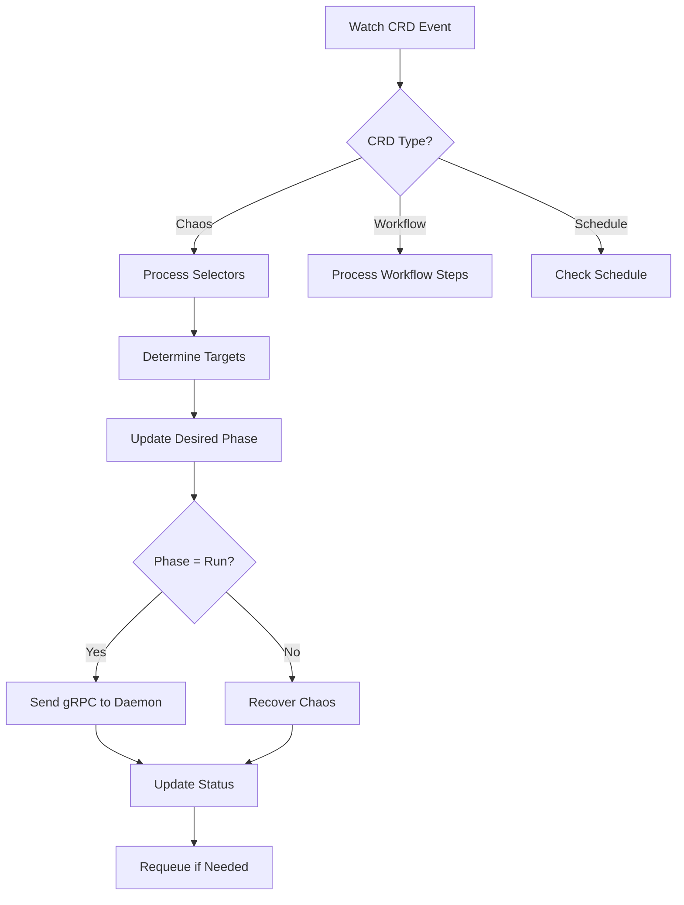
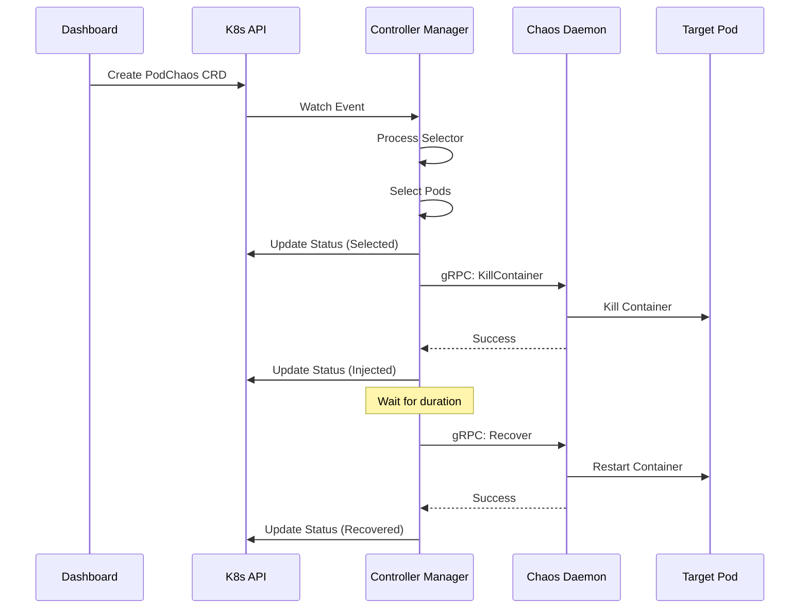

Chaos Mesh is built from three primary components that work together to orchestrate chaos experiments in Kubernetes environments.

## Chaos Controller Manager

The Chaos Controller Manager is the brain of Chaos Mesh, running as a Kubernetes deployment that orchestrates all chaos experiments.

### Responsibilities

<CardGroup cols={2}>
  <Card title="CRD Management" icon="database">
    Watches and reconciles 14+ chaos CRD types and orchestration resources
  </Card>
  
  <Card title="Experiment Scheduling" icon="clock">
    Manages lifecycle, timing, and state transitions of chaos experiments
  </Card>
  
  <Card title="Target Selection" icon="bullseye">
    Processes selectors to identify which pods/resources to target
  </Card>
  
  <Card title="Status Tracking" icon="chart-line">
    Maintains experiment status, conditions, and records
  </Card>
</CardGroup>

### Architecture

**Entry Point**: `cmd/controller-manager/main.go`

**Core Logic**: `controllers/`

The controller manager runs multiple Kubernetes controller-runtime based controllers:

#### Controller Types

**Chaos Type Controllers** (`controllers/chaosimpl/`):
- `awschaos/` - AWS fault injection (EC2, EBS)
- `azurechaos/` - Azure fault injection (VM, Disks)  
- `blockchaos/` - Block device I/O faults
- `dnschaos/` - DNS resolution errors
- `gcpchaos/` - GCP fault injection (Compute Engine, Disks)
- `httpchaos/` - HTTP request/response manipulation
- `iochaos/` - File system I/O faults
- `jvmchaos/` - JVM-level fault injection
- `kernelchaos/` - Kernel fault injection via BPF
- `networkchaos/` - Network faults (delay, loss, partition, etc.)
- `physicalmachinechaos/` - Physical/VM machine faults
- `podchaos/` - Pod lifecycle faults
- `stresschaos/` - CPU and memory stress
- `timechaos/` - Clock skew simulation

**Orchestration Controllers**:
- Workflow Controller - Multi-step chaos scenarios
- Scheduler Controller - Scheduled/recurring experiments
- StatusCheck Controller - Health validation

#### Design Principles

Controllers in Chaos Mesh follow strict design principles (`controllers/README.md`):

<AccordionGroup>
  <Accordion title="One Controller Per Field">
    Each field is controlled by at most one controller to avoid conflicts. This prevents race conditions and makes the system predictable.
    
    **Example**: The pause annotation and duration are handled by the same controller because both affect the `desiredPhase` field.
  </Accordion>
  
  <Accordion title="Standalone Operation">
    Controllers work independently without depending on other controllers. Each controller can be understood and debugged in isolation.
  </Accordion>
  
  <Accordion title="Simple Behavior">
    Controller logic should be describable in ~100 words. Complex logic should be split into multiple controllers or a new CRD.
  </Accordion>
  
  <Accordion title="Error Handling with Backoff">
    For retriable errors, return `ctrl.Result{Requeue: true}, nil` to leverage exponential backoff:
    - Start delay: 5ms
    - Max delay: 1000s
    - Overall rate: 10 qps
  </Accordion>
</AccordionGroup>

### Key Packages

**Selector Processing**: `pkg/selector/`
- Evaluates label selectors, namespace selectors, field selectors
- Determines which pods match the experiment criteria
- Implements selector modes (one, all, fixed, fixed-percent, random-max-percent)

**Metrics**: `pkg/metrics/`
- Prometheus metrics for experiments and controller operations
- Tracks injection counts, failures, and durations

**Webhook Validation**: `api/v1alpha1/*_webhook.go`
- Validates CRD objects before admission
- Applies defaults and performs semantic validation
- Ensures experiments are well-formed

### Controller Reconciliation Flow



## Chaos Daemon

The Chaos Daemon is the execution engine that performs actual fault injection on target pods. It runs as a DaemonSet on every Kubernetes node.

### Responsibilities

<CardGroup cols={2}>
  <Card title="Fault Injection" icon="syringe">
    Executes low-level chaos actions in pod namespaces
  </Card>
  
  <Card title="Namespace Access" icon="network-wired">
    Enters target pod namespaces to manipulate network, filesystem, and processes
  </Card>
  
  <Card title="Runtime Integration" icon="docker">
    Interfaces with Docker, containerd, and CRI-O container runtimes
  </Card>
  
  <Card title="gRPC Server" icon="plug">
    Exposes fault injection APIs to Controller Manager
  </Card>
</CardGroup>

### Architecture

**Entry Point**: `cmd/chaos-daemon/main.go`

**Core Logic**: `pkg/chaosdaemon/`

**Protocol**: `pkg/chaosdaemon/pb/chaosdaemon.proto`

### Privileged Operations

<Warning>
Chaos Daemon runs with privileged permissions by default to perform:
- Namespace manipulation (mount, network, pid namespaces)
- Network configuration (tc, iptables, ipset)
- File system injection (FUSE mounts)
- Kernel module loading (BPF programs)

Privileged mode can be disabled for security, but some chaos types will be limited.
</Warning>

### Fault Injection Mechanisms

#### Network Chaos

**Implementation**: `pkg/chaosdaemon/tc_server.go`, `pkg/chaosdaemon/netem/`

**Technologies**:
- **tc (traffic control)**: Linux kernel's traffic control subsystem
- **netem**: Network emulation using tc qdisc
- **iptables**: Packet filtering and manipulation
- **ipset**: IP address set management for efficient filtering

**Actions**:
- Delay: Add latency with optional jitter and correlation
- Loss: Drop packets with configurable percentage
- Duplicate: Duplicate packets
- Corrupt: Corrupt packet data
- Partition: Block traffic between pods/services
- Bandwidth: Limit bandwidth with token bucket

**File**: `pkg/chaosdaemon/iptables_server.go`, `pkg/chaosdaemon/ipset_server.go`

#### I/O Chaos

**Implementation**: `pkg/chaosdaemon/iochaos_server.go`

**Technology**: FUSE (Filesystem in Userspace)

**Actions**:
- **Latency**: Delay I/O operations
- **Fault**: Return errors on I/O operations
- **AttrOverride**: Modify file attributes
- **Mistake**: Inject incorrect data

**How it works**:
1. Mount FUSE filesystem over target volume path
2. Intercept I/O operations
3. Inject faults based on configuration
4. Pass through or modify operations

#### HTTP Chaos

**Implementation**: `pkg/chaosdaemon/httpchaos_server.go`

**Technology**: Transparent proxy with TLS interception

**Actions**:
- Abort: Return error responses
- Delay: Add latency to requests/responses
- Replace: Modify request/response data
- Patch: Add/modify headers

**Proxy Config**: `pkg/chaosdaemon/tproxyconfig/config.go`

#### DNS Chaos

**Implementation**: `pkg/chaosdaemon/dns_server.go`

**Technology**: Custom DNS server + /etc/resolv.conf manipulation

**Actions**:
- **Error**: Return DNS resolution errors
- **Random**: Return random IP addresses

**Pattern Matching**: Supports wildcards and placeholder matching

#### Stress Chaos

**Implementation**: `pkg/chaosdaemon/stress_server_linux.go`

**Technology**: stress-ng (stress test tool)

**Actions**:
- CPU stress with configurable workers and load percentage
- Memory stress with configurable size and workers

**Command Generation**: Converts stressor specs to stress-ng command-line arguments

#### Time Chaos

**Implementation**: `pkg/chaosdaemon/time_server_linux.go`

**Technology**: Clock offset via vDSO manipulation

**Actions**: Offset system clocks (CLOCK_REALTIME, CLOCK_MONOTONIC, etc.)

**How it works**:
1. Inject library into target container
2. Intercept clock_gettime syscalls
3. Add offset to returned time values

#### JVM Chaos

**Implementation**: `pkg/chaosdaemon/jvm_server.go`

**Technology**: Byteman (JVM bytecode manipulation)

**Actions**:
- **Latency**: Add delay to method invocations
- **Return**: Override return values
- **Exception**: Throw exceptions
- **Stress**: CPU/Memory stress within JVM
- **GC**: Trigger garbage collection
- **MySQL**: Inject faults into MySQL JDBC operations

**How it works**:
1. Attach Byteman agent to target JVM process
2. Inject Byteman rules into target classes/methods
3. Rules execute at specified injection points

#### Kernel Chaos

**Implementation**: Leverages BPF (via bpfki library)

**Actions**: Inject faults into kernel functions
- slab allocation failures
- page allocation failures  
- bio (block I/O) failures

**Configuration**:
- **FailType**: What to fail (0=slab, 1=alloc_page, 2=bio)
- **Callchain**: Specific call chain to target
- **Probability**: Percentage of calls to fail
- **Times**: Maximum number of failures

#### Block Chaos

**Implementation**: `pkg/chaosdaemon/blockchaos_server_linux.go`

**Technology**: Block device I/O interception

**Actions**:
- **Delay**: Add latency to block I/O operations

### Container Runtime Support

**Location**: `pkg/chaosdaemon/crclients/`

Chaos Daemon abstracts container runtime operations through a common interface:

```go
type ContainerRuntimeInfoClient interface {
    GetPidFromContainerID(containerID string) (uint32, error)
    ContainerKill(containerID string, signal string) error
    // ... other operations
}
```

**Implementations**:
- **Docker**: `pkg/chaosdaemon/crclients/docker/client.go`
- **containerd**: `pkg/chaosdaemon/crclients/containerd/client.go`
- **CRI-O**: `pkg/chaosdaemon/crclients/crio/client.go`

### Task Management

**Location**: `pkg/chaosdaemon/tasks/`

Manages ongoing chaos tasks with proper lifecycle:

- **TaskManager**: Tracks active chaos injections (`task_manager.go`)
- **ProcessGroupHandler**: Manages stress processes (`process_group_handler.go`)
- **PodContainerHandler**: Manages container-level tasks (`pod_container_handler.go`)

### Helper Utilities

**Location**: `pkg/chaosdaemon/util/`, `pkg/chaosdaemon/helper/`

- Container inspection and manipulation
- Namespace operations
- Process management
- File system operations

## Chaos Dashboard

The Chaos Dashboard provides a web-based UI for designing, managing, and monitoring chaos experiments.

### Responsibilities

<CardGroup cols={2}>
  <Card title="Experiment Design" icon="pencil">
    Visual interface for creating chaos experiments without YAML
  </Card>
  
  <Card title="Workflow Builder" icon="diagram-project">
    Design complex multi-step chaos scenarios
  </Card>
  
  <Card title="Monitoring" icon="chart-line">
    Real-time status and metrics visualization
  </Card>
  
  <Card title="Access Control" icon="shield">
    RBAC integration for secure multi-user environments
  </Card>
</CardGroup>

### Architecture

**Frontend**: `ui/`
- Technology: React with TypeScript
- Build: pnpm-based build system
- Components: Material-UI based components

**Backend**: `cmd/chaos-dashboard/` and `pkg/dashboard/`
- Technology: Go HTTP server
- API: RESTful + WebSocket for real-time updates
- Authentication: Kubernetes RBAC integration

### Key Features

#### Visual Experiment Creation

The dashboard provides forms for each chaos type with:
- Selector configuration
- Action-specific parameters
- Duration and scheduling
- Preview of generated YAML

#### Workflow Editor

Drag-and-drop interface for creating multi-step workflows:
- Serial and parallel execution
- Conditional execution
- Status checks between steps
- Template support

#### Monitoring Dashboard

- Experiment list with status filtering
- Real-time event stream
- Metrics and graphs
- Detailed experiment history

#### RBAC Integration

Respects Kubernetes RBAC for:
- Namespace isolation
- Resource permissions
- Role-based experiment management

### API Endpoints

**Experiments**:
- `GET /api/experiments` - List experiments
- `POST /api/experiments` - Create experiment
- `GET /api/experiments/{uid}` - Get experiment details
- `DELETE /api/experiments/{uid}` - Delete experiment
- `PUT /api/experiments/{uid}` - Update experiment

**Workflows**:
- `GET /api/workflows` - List workflows
- `POST /api/workflows` - Create workflow

**Events**:
- `GET /api/events` - Get experiment events
- WebSocket `/api/events/ws` - Real-time event stream

### Development

**Frontend Development**:
```bash
cd ui
pnpm install --frozen-lockfile
pnpm start  # Development server
pnpm build  # Production build
```

**Backend Development**:
```bash
make local/chaos-dashboard
```

<Tip>
Set `UI=1` environment variable to include UI assets in dashboard builds.
</Tip>

## Component Interactions

### Experiment Execution Flow



### Cross-Component Communication

**Dashboard → API Server**:
- Protocol: REST/HTTPS
- Authentication: Kubernetes RBAC tokens
- Operations: CRUD on CRDs

**Controller Manager → API Server**:
- Protocol: Kubernetes client-go
- Operations: Watch, Update CRDs
- Leader Election: For HA deployments

**Controller Manager → Chaos Daemon**:
- Protocol: gRPC over TLS
- Operations: Fault injection commands
- Connection: Per-node daemon discovery

**Chaos Daemon → Container Runtime**:
- Protocol: Runtime-specific (Docker API, CRI, etc.)
- Operations: Container inspection, kill, stats

## Deployment Architecture

### Standard Deployment

```yaml
Controller Manager: 3 replicas (HA with leader election)
Chaos Daemon: DaemonSet (1 per node)
Dashboard: 1 replica (can scale horizontally)
```

### Multi-Cluster Support

Chaos Mesh supports multi-cluster chaos experiments:

**Remote Cluster CRDs**: `api/v1alpha1/remote_cluster_types.go`

Experiments can target pods in remote clusters by specifying `remoteCluster` field.

### High Availability

**Controller Manager**:
- Leader election ensures only one active controller
- Multiple replicas for resilience
- Graceful leadership transition

**Chaos Daemon**:
- DaemonSet ensures coverage of all nodes
- Node failure automatically handled by Kubernetes

**Dashboard**:
- Stateless design allows horizontal scaling
- Session state stored in Kubernetes

## Related Resources

<CardGroup cols={2}>
  <Card title="Architecture" icon="sitemap" href="/concepts/architecture">
    High-level architecture overview
  </Card>
  
  <Card title="Chaos Types" icon="bolt" href="/concepts/chaos-types-overview">
    All available chaos types
  </Card>
</CardGroup>
