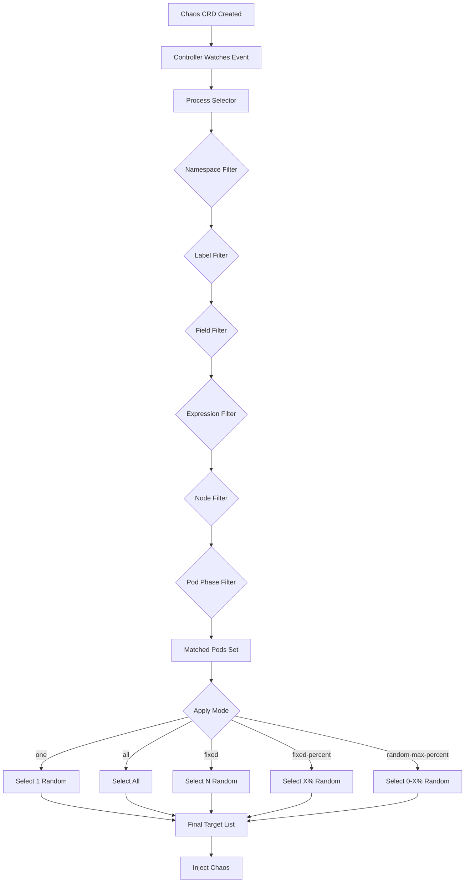

Selectors are the mechanism for defining which pods or resources should be affected by a chaos experiment. Chaos Mesh provides powerful and flexible selector options.

## Overview

Every chaos experiment includes a selector that determines its targets. The selector combines multiple matching criteria to precisely control the scope of fault injection.

**Selector Definitions**: `api/v1alpha1/selector.go`

## Selector Types

Chaos Mesh provides different selector types for different resource types:

<CardGroup cols={2}>
  <Card title="PodSelector" icon="box">
    Selects pods in Kubernetes clusters
  </Card>
  
  <Card title="ContainerSelector" icon="cube">
    Selects specific containers within pods
  </Card>
  
  <Card title="GenericSelector" icon="filter">
    Basic selector for generic resources
  </Card>
  
  <Card title="PhysicalMachineSelector" icon="server">
    Selects physical machines or VMs
  </Card>
</CardGroup>

## PodSelector

The most commonly used selector for pod-based chaos experiments.

**Definition**: `api/v1alpha1/selector.go:69-94`

### Basic Structure

```yaml
selector:
  namespaces: ["default", "production"]
  labelSelectors:
    app: "my-app"
    tier: "backend"
  fieldSelectors:
    status.phase: "Running"
```

### Selection Criteria

<Tabs>
  <Tab title="Namespace Selector">
    Select pods from specific namespaces.
    
    **Type**: `[]string`
    
    **Examples**:
    ```yaml
    # Single namespace
    selector:
      namespaces: ["default"]
    
    # Multiple namespaces
    selector:
      namespaces: ["production", "staging"]
    ```
    
    <Info>
    If `namespaces` is empty, the experiment's own namespace is used by default (`selector.go:96-100`).
    </Info>
  </Tab>
  
  <Tab title="Label Selector">
    Select pods by Kubernetes labels using equality-based matching.
    
    **Type**: `map[string]string`
    
    **Examples**:
    ```yaml
    # Match single label
    selector:
      labelSelectors:
        app: "nginx"
    
    # Match multiple labels (AND logic)
    selector:
      labelSelectors:
        app: "nginx"
        environment: "production"
        version: "v1.2.3"
    ```
    
    **Behavior**: All specified labels must match (AND condition).
  </Tab>
  
  <Tab title="Expression Selector">
    Advanced label selection using set-based expressions.
    
    **Type**: `[]metav1.LabelSelectorRequirement`
    
    **Operators**:
    - `In`: Label value in set
    - `NotIn`: Label value not in set
    - `Exists`: Label exists
    - `DoesNotExist`: Label does not exist
    
    **Examples**:
    ```yaml
    # Match pods with tier in (frontend, backend)
    selector:
      expressionSelectors:
        - key: tier
          operator: In
          values: ["frontend", "backend"]
    
    # Match pods with environment=production AND region exists
    selector:
      labelSelectors:
        environment: "production"
      expressionSelectors:
        - key: region
          operator: Exists
    
    # Complex: exclude beta versions
    selector:
      expressionSelectors:
        - key: app
          operator: In
          values: ["my-app"]
        - key: version
          operator: NotIn
          values: ["beta", "alpha"]
    ```
  </Tab>
  
  <Tab title="Field Selector">
    Select pods by field values (similar to kubectl field selectors).
    
    **Type**: `map[string]string`
    
    **Common Fields**:
    - `metadata.name`: Pod name
    - `metadata.namespace`: Namespace
    - `status.phase`: Pod phase
    - `spec.nodeName`: Node name
    
    **Examples**:
    ```yaml
    # Only running pods
    selector:
      fieldSelectors:
        status.phase: "Running"
    
    # Specific pod
    selector:
      fieldSelectors:
        metadata.name: "my-pod-12345"
    
    # Pods on specific node
    selector:
      fieldSelectors:
        spec.nodeName: "node-1"
    ```
  </Tab>
  
  <Tab title="Annotation Selector">
    Select pods by annotations.
    
    **Type**: `map[string]string`
    
    **Examples**:
    ```yaml
    selector:
      annotationSelectors:
        chaos-testing: "enabled"
        team: "platform"
    ```
  </Tab>
</Tabs>

### Advanced Pod Selection

#### Node Selectors

Select pods running on specific nodes or matching node labels.

```yaml
selector:
  # Pods on specific nodes (by name)
  nodes: ["node-1", "node-2"]
  
  # Pods on nodes with labels
  nodeSelectors:
    disktype: "ssd"
    zone: "us-west-2a"
```

**Source**: `api/v1alpha1/selector.go:74-88`

#### Explicit Pod Selection

Select pods by explicit name (namespace → pod names mapping).

```yaml
selector:
  pods:
    default: ["pod-1", "pod-2"]
    production: ["api-server-1", "api-server-2"]
```

**Source**: `api/v1alpha1/selector.go:78-82`

#### Pod Phase Selection

Filter by pod lifecycle phase.

```yaml
selector:
  podPhaseSelectors:
    - "Running"
    - "Pending"
```

**Valid Phases**:
- `Pending`
- `Running`
- `Succeeded`
- `Failed`
- `Unknown`

**Source**: `api/v1alpha1/selector.go:90-93`

## ContainerSelector

Extends PodSelector to select specific containers within pods.

**Definition**: `api/v1alpha1/selector.go:119-126`

```yaml
selector:
  namespaces: ["default"]
  labelSelectors:
    app: "my-app"
  containerNames: ["app", "sidecar"]
mode: all
```

**Behavior**:
- If `containerNames` is empty, the first container is selected
- Useful for multi-container pods (app + sidecar)
- Used by: IOChaos, StressChaos, TimeChaos, DNSChaos, JVMChaos, KernelChaos

## GenericSelector

Base selector for non-pod resources (used internally).

**Definition**: `api/v1alpha1/selector.go:41-67`

**Fields**:
- `namespaces`: Namespace filter
- `labelSelectors`: Label-based matching
- `fieldSelectors`: Field-based matching
- `expressionSelectors`: Set-based label matching
- `annotationSelectors`: Annotation-based matching

## PhysicalMachineSelector

Selects physical machines or VMs for PhysicalMachineChaos.

**Definition**: `api/v1alpha1/physical_machine_chaos_types.go:119-152`

```yaml
selector:
  # Explicit addresses (deprecated)
  address: ["192.168.1.10", "192.168.1.11"]
  
  # Or use selector
  selector:
    namespaces: ["default"]
    labelSelectors:
      role: "database"
    physicalMachines:
      default: ["machine-1", "machine-2"]
mode: fixed
value: "1"
```

<Warning>
The `address` field is deprecated. Use `selector.physicalMachines` instead.
</Warning>

## Selection Modes

After selecting a set of matching targets, the mode determines how many should be affected.

**Definition**: `api/v1alpha1/selector.go:23-39`

### Mode Types

<Tabs>
  <Tab title="one">
    Select **one random** target from the matching set.
    
    ```yaml
    mode: one
    selector:
      namespaces: ["default"]
      labelSelectors:
        app: "nginx"
    # Affects 1 random nginx pod
    ```
    
    **Use Case**: Test resilience to single pod failure
  </Tab>
  
  <Tab title="all">
    Select **all** matching targets.
    
    ```yaml
    mode: all
    selector:
      namespaces: ["default"]
      labelSelectors:
        app: "nginx"
    # Affects all nginx pods
    ```
    
    **Use Case**: Test complete service outage
    
    <Warning>
    Be cautious with `all` mode - it affects all matching resources regardless of status (including not-ready pods).
    </Warning>
  </Tab>
  
  <Tab title="fixed">
    Select a **fixed number** of random targets.
    
    ```yaml
    mode: fixed
    value: "3"
    selector:
      namespaces: ["default"]
      labelSelectors:
        app: "nginx"
    # Affects exactly 3 random nginx pods
    ```
    
    **Value**: Integer as string (e.g., "3")
    
    **Use Case**: Test partial service degradation
  </Tab>
  
  <Tab title="fixed-percent">
    Select a **fixed percentage** of random targets.
    
    ```yaml
    mode: fixed-percent
    value: "50"
    selector:
      namespaces: ["default"]
      labelSelectors:
        app: "nginx"
    # Affects 50% of nginx pods
    ```
    
    **Value**: Percentage 0-100 as string (e.g., "50")
    
    **Use Case**: Proportional fault injection that scales with deployment size
  </Tab>
  
  <Tab title="random-max-percent">
    Select a **random percentage** (0 to max) of targets.
    
    ```yaml
    mode: random-max-percent
    value: "50"
    selector:
      namespaces: ["default"]
      labelSelectors:
        app: "nginx"
    # Affects 0-50% of nginx pods (random each time)
    ```
    
    **Value**: Max percentage 0-100 as string (e.g., "50")
    
    **Use Case**: Variable fault injection to test different failure scenarios
  </Tab>
</Tabs>

**Source**: `api/v1alpha1/selector.go:102-117`

## Cloud Provider Selectors

Cloud provider chaos types use specialized selectors:

### AWSSelector

**Definition**: `api/v1alpha1/awschaos_types.go:83-109`

```yaml
awsRegion: "us-west-2"
ec2Instance: "i-1234567890abcdef0"
ebsVolume: "vol-1234567890abcdef0"  # For detach-volume
deviceName: "/dev/sdf"              # For detach-volume
```

### GCPSelector

**Definition**: `api/v1alpha1/gcpchaos_types.go:79-94`

```yaml
project: "my-gcp-project"
zone: "us-central1-a"
instance: "my-instance"
deviceNames: ["disk-1"]  # For disk-loss
```

### AzureSelector

**Definition**: `api/v1alpha1/azurechaos_types.go:75-102`

```yaml
subscriptionID: "sub-12345"
resourceGroupName: "my-rg"
vmName: "my-vm"
diskName: "data-disk"  # For disk-detach
lun: 0                 # For disk-detach
```

## Selector Examples

### Example 1: Target Specific Application

```yaml
apiVersion: chaos-mesh.org/v1alpha1
kind: PodChaos
metadata:
  name: pod-kill-example
  namespace: chaos-testing
spec:
  action: pod-kill
  mode: one
  selector:
    namespaces: ["production"]
    labelSelectors:
      app: "my-api"
      version: "v2.0"
  duration: "30s"
```

**Effect**: Kill 1 random pod from `my-api` v2.0 in production namespace.

### Example 2: Target Running Pods on SSD Nodes

```yaml
apiVersion: chaos-mesh.org/v1alpha1
kind: NetworkChaos
metadata:
  name: network-delay-ssd
spec:
  action: delay
  mode: fixed-percent
  value: "30"
  selector:
    namespaces: ["default"]
    labelSelectors:
      app: "database"
    nodeSelectors:
      disktype: "ssd"
    fieldSelectors:
      status.phase: "Running"
  delay:
    latency: "100ms"
  duration: "5m"
```

**Effect**: Add 100ms latency to 30% of running database pods on SSD nodes.

### Example 3: Exclude Beta Versions

```yaml
apiVersion: chaos-mesh.org/v1alpha1
kind: StressChaos
metadata:
  name: cpu-stress
spec:
  mode: all
  selector:
    namespaces: ["production"]
    labelSelectors:
      app: "worker"
    expressionSelectors:
      - key: version
        operator: NotIn
        values: ["beta", "canary"]
  stressors:
    cpu:
      workers: 2
      load: 80
  duration: "10m"
```

**Effect**: Stress all worker pods except beta and canary versions.

### Example 4: Target Specific Containers

```yaml
apiVersion: chaos-mesh.org/v1alpha1
kind: IOChaos
metadata:
  name: io-latency
spec:
  action: latency
  mode: one
  selector:
    namespaces: ["default"]
    labelSelectors:
      app: "app-with-sidecar"
    containerNames: ["main-app"]  # Only affect main container
  volumePath: "/data"
  path: "/data/cache/*"
  delay: "100ms"
  percent: 50
  duration: "1m"
```

**Effect**: Add I/O latency only to the main-app container, not the sidecar.

### Example 5: Multi-Namespace Selection

```yaml
apiVersion: chaos-mesh.org/v1alpha1
kind: TimeChaos
metadata:
  name: time-skew
spec:
  mode: fixed
  value: "2"
  selector:
    namespaces:
      - "service-a"
      - "service-b"
      - "service-c"
    labelSelectors:
      chaos-ready: "true"
  timeOffset: "-1h"
  duration: "30m"
```

**Effect**: Offset time by -1 hour on 2 random pods across three namespaces.

## Selector Processing Flow



**Implementation**: `pkg/selector/`

## Cluster-Scoped Selection

A selector is cluster-scoped if it doesn't specify namespaces or explicit pods.

**Check Function**: `api/v1alpha1/selector.go:128-138`

```go
func (in PodSelectorSpec) ClusterScoped() bool {
    if len(in.Namespaces) == 0 && len(in.Pods) == 0 {
        return true
    }
    return false
}
```

<Info>
In practice, cluster-scoped selection is rare because the default namespace is added automatically if none is specified.
</Info>

## Selector Best Practices

<CardGroup cols={2}>
  <Card title="Start Small" icon="seedling">
    Use `mode: one` or `mode: fixed` with small values when testing new experiments.
  </Card>
  
  <Card title="Use Labels" icon="tag">
    Add chaos-specific labels to pods (e.g., `chaos-ready: "true"`) for better control.
  </Card>
  
  <Card title="Filter by Phase" icon="filter">
    Use `podPhaseSelectors: ["Running"]` to avoid affecting terminating pods.
  </Card>
  
  <Card title="Test Selectors" icon="vial">
    Use `kubectl get pods -l app=myapp` to verify selector matches before running chaos.
  </Card>
  
  <Card title="Namespace Isolation" icon="border-all">
    Always specify namespaces explicitly to avoid accidental cross-namespace impact.
  </Card>
  
  <Card title="Combine Criteria" icon="layer-group">
    Use multiple selector types together for precise targeting.
  </Card>
</CardGroup>

## Common Selector Patterns

### Pattern: Canary Testing

```yaml
selector:
  namespaces: ["production"]
  labelSelectors:
    app: "my-app"
    canary: "true"
mode: all
```

Affect only canary deployments.

### Pattern: Regional Failure

```yaml
selector:
  namespaces: ["production"]
  nodeSelectors:
    topology.kubernetes.io/zone: "us-west-2a"
mode: all
```

Simulate availability zone failure.

### Pattern: Gradual Rollout

```yaml
# Experiment 1: 10%
mode: fixed-percent
value: "10"

# Experiment 2: 25%
mode: fixed-percent
value: "25"

# Experiment 3: 50%
mode: fixed-percent
value: "50"
```

Gradually increase chaos scope.

### Pattern: Database Replica Testing

```yaml
selector:
  namespaces: ["database"]
  labelSelectors:
    app: "postgres"
  expressionSelectors:
    - key: role
      operator: In
      values: ["replica"]
mode: one
```

Test replica failure without affecting primary.

## Troubleshooting Selectors

### No Pods Selected

**Check**:
1. Verify labels exist: `kubectl get pods -n <namespace> --show-labels`
2. Test label selector: `kubectl get pods -n <namespace> -l app=myapp`
3. Check namespace spelling
4. Verify pods are in correct phase

### Too Many Pods Selected

**Solution**:
1. Add more specific labels
2. Use `expressionSelectors` with `NotIn`
3. Add `fieldSelectors` for phase/node
4. Use `pods` explicit selection

### Selector Matches No Running Pods

**Solution**:
```yaml
selector:
  fieldSelectors:
    status.phase: "Running"  # Add this
```

## Related Resources

<CardGroup cols={3}>
  <Card title="Architecture" icon="sitemap" href="/concepts/architecture">
    How selectors are processed
  </Card>
  
  <Card title="Chaos Types" icon="bolt" href="/concepts/chaos-types-overview">
    Which selectors each type uses
  </Card>
  
  <Card title="API Reference" icon="code" href="/api/overview">
    Complete API documentation
  </Card>
</CardGroup>
